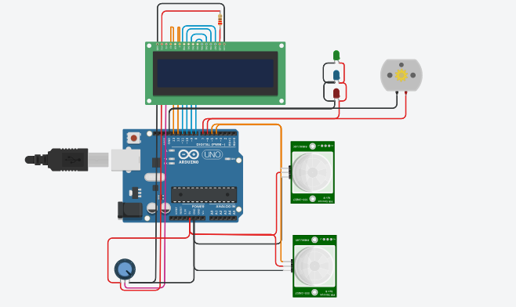

# Automatic-room-controller
<h3>This is a personal project on automatic light and fan control using Arduino UNO.</h3>
The circuit design is shown in this image: 
 
The main code is in the main.c file.
